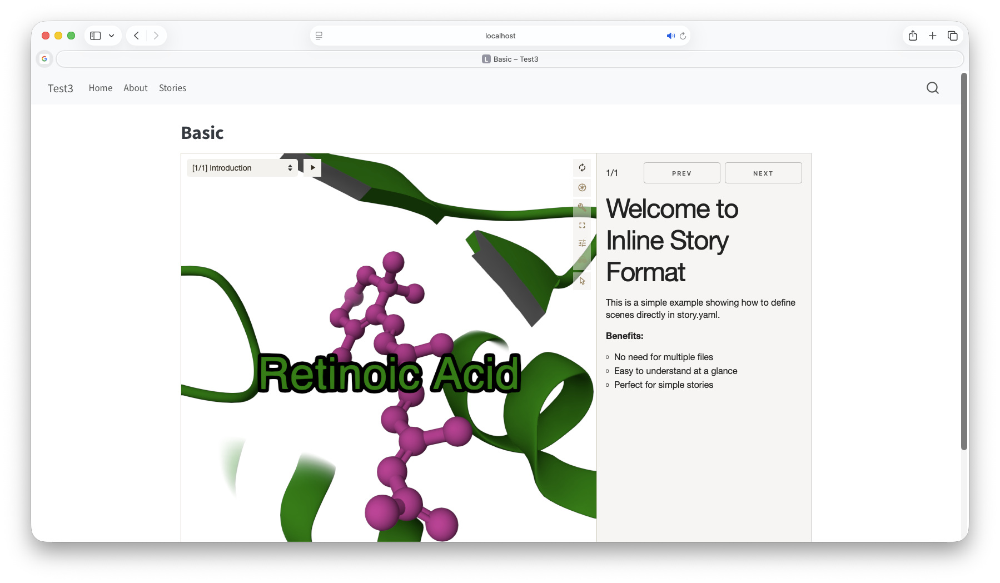

# mol-view-story Format

## Installing

```bash
quarto use template zachcp mvs-quarto
```

This will install the extension and create an example qmd file that you can use as a starting place for your article.

## Using

Prerequisites: the `mvs` binary installed. currently needs manual installation from 

## Format Options


## Example


